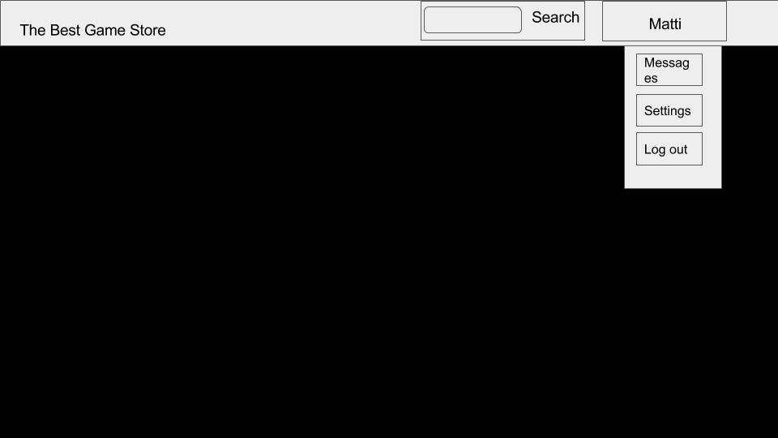

**The Best Game Store**

### [== Project Documentation ==](DOCUMENTATION.md)

Project plan
-----------------------

### 1. Team

* Valtteri Lipsanen
* Antero Vaarnamo
* Viljami Virolainen

### 2. Goal

The goal is to design and implement an online store jor JavaScript games. The service would have two distinct user groups: the developers and the players. Developers would be able to add their games to the webshop and set prices for them, and the players could buy them and play their purchaced games online.

### 3. Plans

#### 3.1. Page layout

* Horizontal navbar is displayed up top with links to home, available games, highscores and login/logout pages. Button for login/logout is aligned right and the others left.
* On the login page there will be login form for registered users, players and developers and possibility to login with gmail/facebook account. For new, unregistered users a link for registering is provided. If user successfully logs in, the user's purchased/developed games are shown below.
* On the higscores page a form for selecting games by developer and a search form by games name are shown and highscores about a particular game are shown below.
* On the available games page a form for selecting games by developer and a search form by games name are shown. The game(s) are shown below and after clicking the window, the user is forwarded to the game information page. On this page if the user is of type player and owns the game he/she can start playing it and otherwise is forwarded to the purchase page. On the game information page a developer can make modifications to the game (price, delete etc.)

#### 3.2. Wireframe design

#### 3.3. Models

Database structure with the following tables and columns

* Developer: name, email, password, games
* Player: name, email, password, games
* Game: name, developer, price, image, url, description
* Highscore: gameName, playerName, score

#### 3.4. Views

* HTML views for showing e.g. higscores and available games with templates.
* Views for handling JSON data

#### 3.4. Control Methods

The website is controlled with mouse and keyboard on desktop. Mobile users will use touch control and can use it to browse the website, buy etc. If games are playable on mobile depends on the developer.

#### 3.5. Priorities

* First priority is to develop a basic working framework for the site with all the minimum requirements.
 * Templates, views, models and logging in.
 * Adding and managing games as developer.
 * Buying and playing games as customer
 * Highscores

* Later start adding non-mandatory functionalities
 * Improve UI and site security
 * Make the site mobile and tablet friendly
 * Use RESTful API for showing e.g. highscores or available games
 * Make a simple javascript game
 * Include social media sharing

### 4. Process and Time Schedule

The project will be started during the first weeks in 2018.

* Weeks 1 to 3 Getting to know the framework, testing different options and building the basic framework with minimum functionalities.
* Weeks 4 to 6 Adding non-mandatory functionalities to the game
* Week 7 Finalisation

### 5. Testing

The online store will go through thorough testing to find out if there are any bugs or vulnerabilities. The tests will include:

* Testing the basic use of the webstore while logged in and while logged out.

* Testing the webstore's recovery after an error.

* Testing the cookies and their consistency on different pages and after javascript injections.

* Testing the webstore against javascript injections. (Form manipulation, cookie manipulation etc.)

* Testing against privilege escalation.

* Testing against fetching secure information.

### 6. Risk Analysis

If good progress is not made early when the period is starting, it can become challenging to find time for the project as other courses course load starts increasing.
So better focus on delivering MVP early.

As always with group projects, it is a challenge how to coordinate working and share the worload together. We will keep communicating through whatsapp and also commit messages in git. Thankfully django makes it easier to share work as the project becomes more structured based on how django apps work. It is easy to divide work so that somebody does some view, template etc.

Also basic communication and coordination of project can be sometimes challenging. We will try our best at it by using git and whatsapp actively we will keep everybody updated on what is happening with the project.
